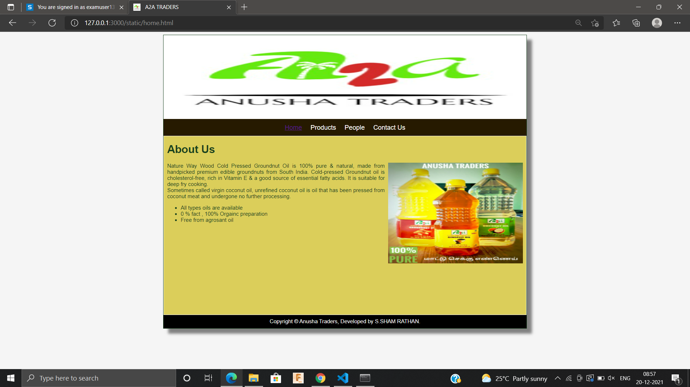

# Web Design for a Software Product Company

## AIM:

To design a static website for a software product company company.

## DESIGN STEPS:

### Step 1:

Requirement collection.

### Step 2:

Creating the layout using HTML and CSS.

### Step 3:

Updating the sample content.

### Step 4:

Choose the appropriate style and color scheme.

### Step 5:

Validate the layout in various browsers.

### Step 6:

Validate the HTML code.

### Step 6:

Publish the website in the given URL.

## PROGRAM :
```
CSS CODE: 

* {
  box-sizing: border-box;
  font-family: Arial, Helvetica, sans-serif;
}
body {
  background-color: whitesmoke;
  color: #17421d;
}
.container {
  width: 1080px;
  margin-left: auto;
  margin-right: auto;
  border-width: 1px 1px 1px 1px;
  border-style: solid;
  box-shadow: 15px 15px 8px gray;
}

.banner {
  display: block;
  width: 100%;
  height: 250px;
  text-align: center;
  font-size: 60px;
  background-image: url("/static/img/banner1.jpg");
  background-size: 100% 100%;
  margin: 0px 0px 0px 0px;
  padding-top: 150px;
  color: #808DBD;
}

.menu {
  display: block;
  width: 100%;
  height: 50px;
  font-size: larger;
  background-color: #261A00;
  text-align: center;
  padding-top: 15px;
  margin: 0px 0px 0px 0px;
  border-width: 1px;
}

.menuitem {
  display: inline-block;
  margin-left: 10px;
  margin-right: 10px;
}
.menuitemselected {
  display: inline-block;
  margin-left: 10px;
  margin-right: 10px;
  color: white;
}

.menuitem a {
  text-decoration: none;
  color: white;
}

.content {
  display: block;
  width: 100%;
  background-color: #dbce5a;
  min-height: 500px;
  margin: 0px 0px 0px 0px;
  border-width: 1px;
  border-color: white;
  border-style: solid;
}
.homecontent {
  min-height: 500px;
  margin: 10px 10px 10px 10px;
}
.homecontent h1 {
  text-align: left;
}
.homecontent img {
  float: right;
  width: 400px;
  height: 300px;
  margin-left: 10px;
}

.contenttext {
  text-align: justify;
}

.productcontent {
  min-height: 500px;
  margin: 10px 10px 10px 10px;
}

.productcontent h1 {
  text-align: left;
}

.productitems {
  display: block;
}

.productitem {
  display: inline-block;
  width: 30%;
  height: 250px;
  text-align: center;
}

.productitem img {
  width: 200px;
  height: 100px;
  display: block;
}
.productitem .itemimage {
  display: block;
  margin-left: auto;
  margin-right: auto;
  width: 100px;
  margin-bottom: 5px;
}

.productitem .itemname {
  display: block;
}
.productitem .itemprice {
  display: block;
}

.footer {
  display: block;
  width: 100%;
  height: 40px;
  background-color: black;
  text-align: center;
  padding-top: 10px;
  margin: 0px 0px 0px 0px;
  color: white;
}

HOME CODE:

<!DOCTYPE html>
<html lang="en">
  <head>
    <title>A2A TRADERS</title>
    <link rel="stylesheet" href="./css/layout.css" />
    <link rel="icon" href="./img/icon.jpg" type="image/x-icon" />
  </head>

  <body>
    <div class="container">
      <div class="banner"></div>
      <div class="menu">
        <div class="menuitemselected"><a href="/static/home.html">Home</a></div>
        <div class="menuitem"><a href="/static/products.html">Products</a></div>
        <div class="menuitem"><a href="/static/people.html">People</a></div>
        <div class="menuitem"><a href="/static/Contact.html">Contact Us</a></div>
      </div>
      <div class="content">
        <div class="homecontent">
          <h1>About Us</h1>
          
          <div class="contenttext">
            Nature Way Wood Cold Pressed Groundnut Oil is 100% pure & natural, made from handpicked premium edible groundnuts from South India. Cold-pressed Groundnut oil is cholesterol-free, rich in Vitamin E & a good source of essential fatty acids. It is suitable for deep fry cooking.
            
      
            <br />
            Sometimes called virgin coconut oil, unrefined coconut oil is oil that has been pressed from coconut meat and undergone no further processing.
            <ul>
              <li>All types oils are available</li>
              <li>0 % fact , 100% Orgainc preparation</li>
              <li>Free from agrosant oil</li>
            </ul>
          </div>
        </div>
      </div>
      <div class="footer">
        Copyright &#169; Anusha Traders, Developed by S.SHAM RATHAN.
      </div>
    </div>
  </body>
</html>

PRODUCT CODE:

<!DOCTYPE html>
<html lang="en">
  <head>
    <title>A2A TRADERS</title>
    <link rel="stylesheet" href="./css/layout.css" />
    <link rel="icon" href="./img/icon.jpg" type="image/x-icon" />
  </head>
  <body>
    <div class="container">
      <div class="banner"></div>
      <div class="menu">
        <div class="menuitem"><a href="/static/home.html">Home</a></div>
        <div class="menuitemselected">
          <a href="/static/products.html">Products</a>
        </div>
        <div class="menuitem"><a href="/static/People.html">People</a></div>
        <div class="menuitem"><a href="/static/Contact us.html">Contact Us</a></div>
      </div>
      <div class="content">
        <div class="productcontent">    
          <h1>OUR PREMIUM PRODUCTS</h1>
          <div class="productitems">
              <div class="productitem"> 
                  <div class="itemimage">
                  
                  </div>
                  <div class="itemname">Coconutoil 
                  </div>                
                  <div class="itemprice">price:300 </div>
              </div>
              <div class="productitem"> 
                  <div class="itemimage">
                  
                  </div>
                  <div class="itemname">groundnutoil
                  </div>
                  <div class="itemprice">price:400</div>
              </div>
              <div class="productitem"> 
                <div class="itemimage">
                
                </div>
                <div class="itemname">Ginigly oil
                </div>
                <div class="itemprice">price:500</div>
            </div>
            <div class="productitem"> 
              <div class="itemimage">
              
              </div>
              <div class="itemname">Castor oil
              </div>
              <div class="itemprice">price:600</div>
          </div>
          <div class="productitem"> 
            <div class="itemimage">
            
            </div>
            <div class="itemname">Essantial oil
            </div>
            <div class="itemprice">price:700</div>
        </div>
        <div class="productitem"> 
          <div class="itemimage">
          
          </div>
          <div class="itemname">Herbal oil
          </div>
          <div class="itemprice">price:800</div>
      </div>
      <div class="productitem"> 
        <div class="itemimage">
        
        </div>
        <div class="itemname">Eucalyptus oil
        </div>
        <div class="itemprice">price:900</div>
    </div>
    <div class="productitem"> 
      <div class="itemimage">
      
      </div>
      <div class="itemname">extra-virgin olive oil
      </div>
      <div class="itemprice">price:1900</div>
    </div> 
    <div class="productitem"> 
      <div class="itemimage">
      
      </div>
      <div class="itemname">sunflower oil
      </div>
      <div class="itemprice">price:00</div>
    </div> 
      
            
            </div>
          </div>
          </div> 
          <div class="footer">
            Copyright &#169; 2021 Rockstar Private Limited, Developed by S.Sham Rathan 
             
          </div>
        
      

    </div>
    
  </body>
</html>

PEOPLE CODE:

<!DOCTYPE html>
<html lang="en">
  <head>
    <title>A2A TRADERS</title>
    <link rel="stylesheet" href="./css/layout.css" />
    <link rel="icon" href="./img/icon.jpg" type="image/x-icon" />
  </head>

  <body>
    <div class="container">
      <div class="banner"></div>
      <div class="menu">
        <div class="menuitem"><a href="/static/home.html">Home</a></div>
        <div class="menuitem"><a href="/static/products.html">Products</a>
        </div>
        <div class="menuitemselected"><a href="/static/People.html">People</a></div>

        <div class="menuitem"><a href="/static/Contact us.html">Contact Us</a></div>
      </div>
      <div class="content">
        <div class="productcontent">    
          <h1>WE HAVE DEALERS ALL OVER TAMIL NADU</h1>
          <div class="productitems">
              <div class="productitem"> 
                  <div class="itemimage">
                  
                  </div>
                  <div class="itemname">NITHISHWAR</div>
                  <div class="itemprice">Chennai-9500063805 </div>
              </div>

              <div class="productitem"> 
                <div class="itemimage">
                
                </div>
                <div class="itemname">Ashwin</div>
                <div class="itemprice"> Kangipuram-9988774455 </div>
            </div>
            <div class="productitem"> 
              <div class="itemimage">
              
              </div>
              <div class="itemname">Jeeva</div>
              <div class="itemprice">Salem-9685741425</div>
          </div>
          <div class="productitem"> 
            <div class="itemimage">
            
            </div>
            <div class="itemname">Kirupanandhan </div>
            <div class="itemprice">Madurai-9638527410</div>
        </div>
        <div class="productitem"> 
          <div class="itemimage">
          
          </div>
          <div class="itemname">Monoj kumar</div>
          <div class="itemprice">Coimbatore-9517532846</div>
      </div>
      <div class="productitem"> 
        <div class="itemimage">
        
        </div>
        <div class="itemname">Sham Rathan</div>
        <div class="itemprice">Executive Officer</div>
    </div>
              </div>
              <div class="footer">
                Copyright &#169; 2021 Rockstar Private Limited, Developed by S.Sham Rathan
            
              </div>    
              
          </div>
          </div>        
      </div>
      

    </div>
  </body>
</html>

CONTACT US CODE:

<!DOCTYPE html>
<html lang="en">
  <head>
    <title>A2A TRADERS</title>
    <link rel="stylesheet" href="./css/layout.css" />
    <link rel="icon" href="./img/icon.jpg" type="image/x-icon" />
  </head>

  <body>
    <div class="container">
        <div class="banner"></div>

      <div class="menu">
        <div class="menuitem"><a href="/static/home.html">Home</a></div>
        <div class="menuitem"><a href="/static/products.html">Products</a>
        </div>
        <div class="menuitem"><a href="/static/People.html">People</a></div>

        <div class="menuitemselected"><a href="/static/Contact us.html">Contact Us</a></div>
      </div>
      <div class="content">
    
        <div class="content">
          <div class="homecontent">
          
            
        
        <br>196,Salem-Chennai NH road,</br>
        <br>Near Saraswathi Schaool</br>
        <br>Salem(Dt)</br>
        <br>Phn: 044-48485 48485</br>
        <br>email-oiltraders@gamil.com</br>
      </div>

      </div>
          </div>
          </div>        
      </div>
      <div class="footer">
        Copyright &#169; 2021 EduSoft Private Limited, Developed by S.Sham Rathan.
      </div>
    </div>
  </body>
</html>
```


## OUTPUT:




## Result:

Thus a website is designed for the product company and the HTML,CSS code are validated.
